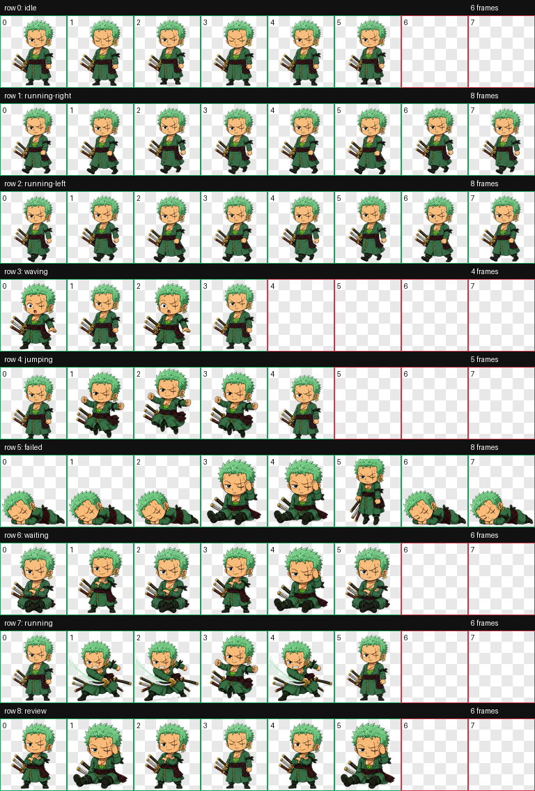
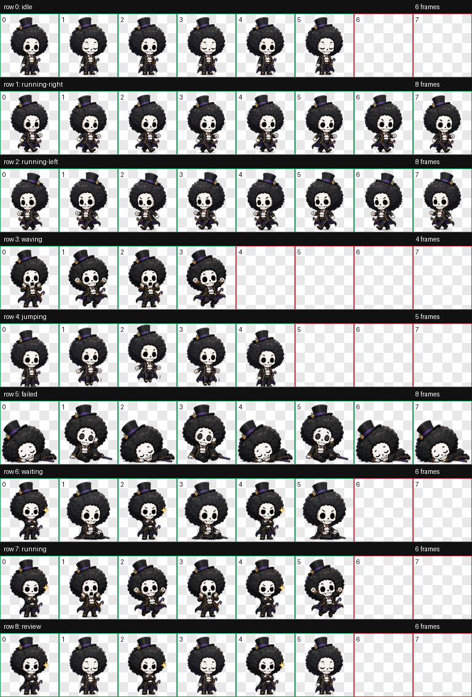
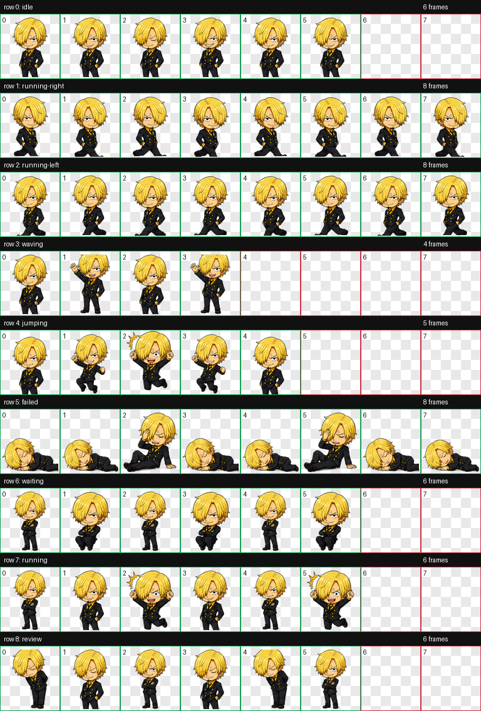
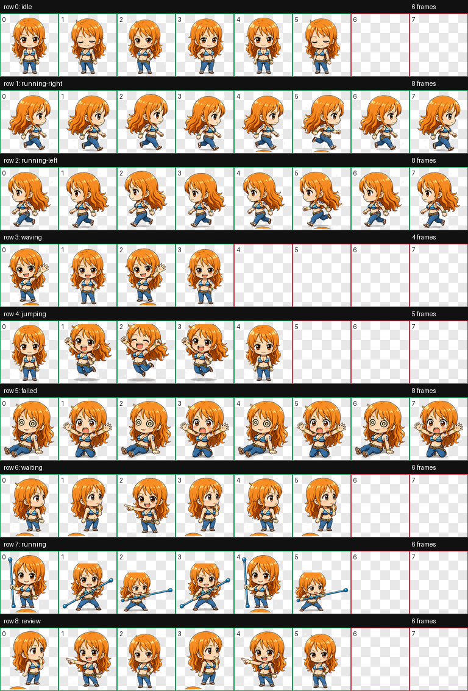
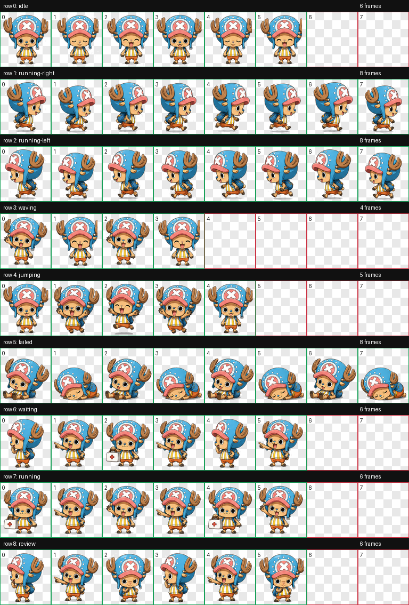

# Codex Pets 4 Fun

A growing collection of unofficial one piece custom pets for the Codex desktop app.

## Meet the pets

| Zoro | Brook | Sanji | Nami | Chopper |
| --- | --- | --- | --- | --- |
|  |  |  |  |  |
| [Open Zoro package](pets/zoro-santoryu/) | [Open Brook package](pets/brook-soul-king/) | [Open Sanji package](pets/sanji-black-leg/) | [Open Nami package](pets/nami-navigator/) | [Open Chopper package](pets/chopper-doctor/) |

## Install

1. Open the selected pet package above.
2. Download its WebP spritesheet and `pet.json`.
3. Create `~/.codex/pets/<pet-id>/`.
4. Put the downloaded files in the folder, preserving their filenames.
5. In Codex, open **Settings > Pets**, choose **Refresh**, then select your pet.

## Add more

Each new pet lives in its own directory under `pets/`, containing:

- `pet.json`
- a transparent WebP spritesheet
- a preview image

## Note

These are unofficial fan projects for personal use. Any depicted third-party characters are trademarks and copyrighted properties of their respective rightsholders. This repository is not affiliated with or endorsed by those rightsholders, and it grants no rights to the underlying character IP.
